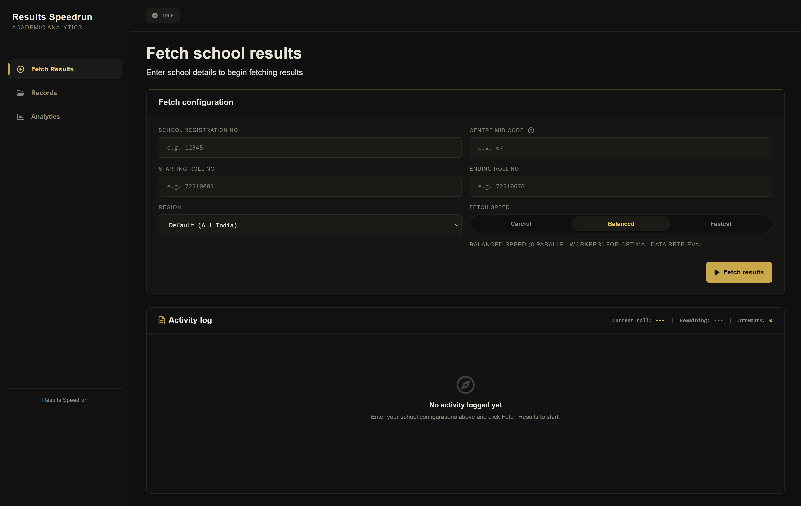
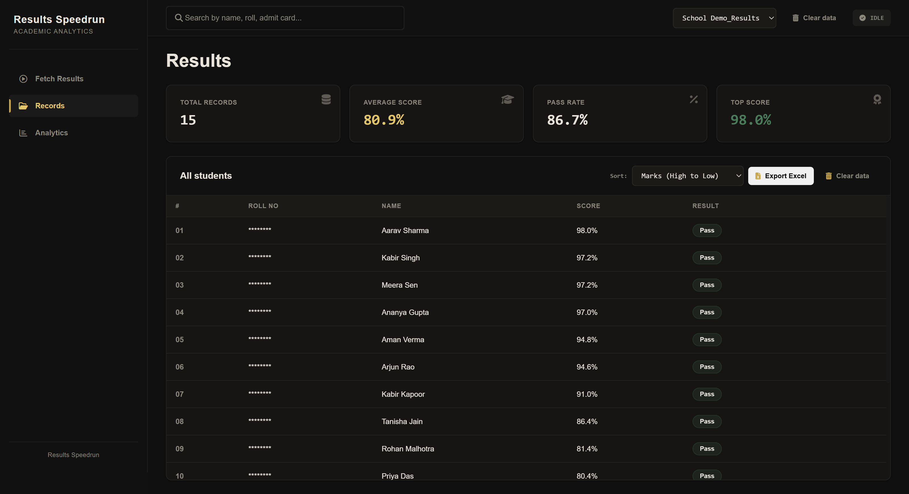
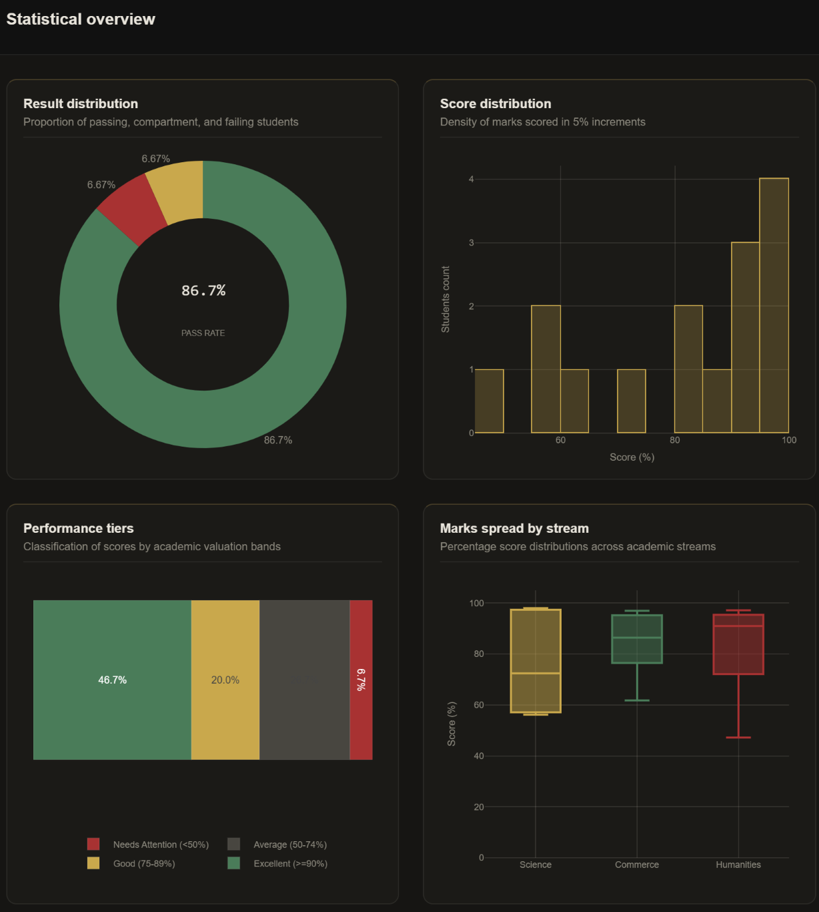

<p align="center">
  <h1 align="center">CBSE Result Scraper</h1>
  <p align="center">Parallel scraping engine & analytics dashboard for CBSE Class XII results.</p>
</p>

<p align="center">
  
  
  
  
  
  
  
</p>

---

- [Why this exists](#why-this-exists)
- [Disclaimer](#-disclaimer)
- [Run it locally](#run-it-locally)
- [Requirements](#requirements)
- [Quick Start](#quick-start)
- [How to use it](#how-to-use-it)
- [How it works](#how-it-works)
- [Output](#output)
- [Screenshots](#screenshots)
- [Troubleshooting](#troubleshooting)
- [License](#license)

---

### Why this exists

CBSE's result portal has two hard problems: every student needs a unique admit card ID you don't have, and the WAF bans anything that smells like a bot.

Most scrapers give up on unknown IDs, run headless Playwright until the IP gets flagged, and dump raw CSVs. This project started because none of that survives a real school run.

What's different:

1. **Cracks admit IDs automatically** — frequency-ranked prefix search hits the right one in ~5 attempts instead of 676. v1 brute-forced everything; v2 learned from historical data; v3 added school-specific caching. Each version halved the time to first result.

2. **Evades CBSE's bot detection** — runs headful on a residential IP. CBSE's WAF looks for headless flags, consistent timing, and missing GPU fingerprints. Headful Chrome looks like any real visitor. We survived 31 consecutive roll ranges this way. Headless attempts got banned at roll 3. (Yes, we tried Selenium first. No, it didn't end well.)

3. **Ships with a full dashboard** — interactive charts, multi-sheet Excel export, searchable records. You don't need a separate analytics tool.

**Maintenance is by design.** CBSE changes selectors, form fields, and result URLs every session. Each moving part has its own file under `cbse/` — endpoints, selectors, form logic, parser, prefixes — every one with an `>>> EDIT THIS FILE <<<` header. When something breaks, you edit one file and move on.

---

### ⚠️ Disclaimer

For educational and personal use only. You're responsible for complying with CBSE's terms of service. Only access results you're authorised to view.

---

### Run it locally

Desktop-only. This isn't a preference — it's a technical requirement. CBSE's WAF flags server-grade IP ranges immediately, and headless mode exposes a detectable TLS fingerprint that Playwright's stealth helpers can't fully mask. Headful Chrome on a residential connection is indistinguishable from a real visitor browsing the portal.

The tradeoff: each parallel context needs its own GPU surface, DOM state, and browser fingerprint. A 16-context session eats 2–4 GB RAM. That's the cost of looking like 16 different users behind a NAT instead of one scraper. Shared contexts (1 fingerprint × 16 tabs) got banned at roll 16 in our testing — individual contexts survived the full run.

---

### Requirements

- Python 3.10+
- A display — headful browsing requires a desktop environment
- `playwright install chromium` after pip install

---

### Quick Start

```bash
pip install -r requirements.txt
playwright install chromium
python app.py
```

Open [http://127.0.0.1:5000](http://127.0.0.1:5000).

---

### How to use it

1. Open the app in your browser.
2. Enter the **school code**, **roll number range**, and **centre MID**.
3. The engine cracks the admit ID automatically — or you can provide a known prefix to skip cracking.
4. Click **Start** — watch the live worker terminals stream results.
5. Browse results in **Records**, explore charts in **Analytics**, or export to Excel.

**Fields:**

| Field | Description |
|---|---|
| School code | 7-digit CBSE school code |
| Roll range | Start and end roll numbers to scrape |
| Centre MID | Centre identifier — part of the admit card ID |
| Prefix | 2-letter component derived from parents' initials. The engine cracks this automatically; provide it if you already know it. |

---

### How it works

CBSE admit card IDs follow a predictable format:

```
[2-letter prefix] + [last 2 of roll] + [first 2 of school] + [centre MID]
```

The prefix is the only unknown — 676 possible letter pairs. The engine tries them in priority order:

| Optimization | What it does |
|---|---|
| Frequency-weighted ranking | ~5 attempts per student instead of 676 |
| School-specific live learning | Cracked prefixes get priority for remaining rolls |
| Configurable parallel contexts (capped at 20) | Each worker gets a unique UA and viewport |
| Shared rate-limit cooldown | One IP block pauses all workers — not just the offending one |
| Auto-cache (`prefix_map.csv`) | Re-runs are instant — no re-cracking |

**When CBSE breaks something — and they will:** each concern is isolated in its own file. The URL lives in `cbse/endpoints.py`, XPath selectors in `cbse/selectors.py`, form interactions in `cbse/form.py`, HTML parsing in `cbse/parser.py`, and prefix lists in `cbse/prefixes.py`. Every one has a `>>> EDIT THIS FILE <<<` header pointing you at exactly what to change. If CBSE adds CAPTCHA, this tool pauses until you intervene — by design.

---

### Output

All data lives in `data/`:

| File | Contents |
|---|---|
| `{school}_results.csv` | Scraped results per run |
| `prefix_map.csv` | Learned prefix cache — reused across runs so cracking is instant |
| `{school}_results.xlsx` | Multi-sheet Excel export with embedded charts |

---

### Screenshots

<p align="center">
  
</p>

| Scraper | Records | Analytics |
|---|---|---|
|  |  |  |

---

### Troubleshooting

| Issue | Likely cause / fix |
|---|---|
| `playwright` not found | Run `playwright install chromium` |
| No results returned | CBSE may be rate-limiting you. Wait a few minutes and retry. |
| Workers fail to connect | CBSE's portal may be down (it happens). Check `https://cbseresults.nic.in` in a browser first. |
| CBSE changes the result page | Edit the corresponding file in `cbse/` — each one has a `>>> EDIT THIS FILE <<<` header explaining what to change. |

---

<p align="center">
  <sub>MIT © 2026 — built with assistance from AI coding tools</sub>
</p>
